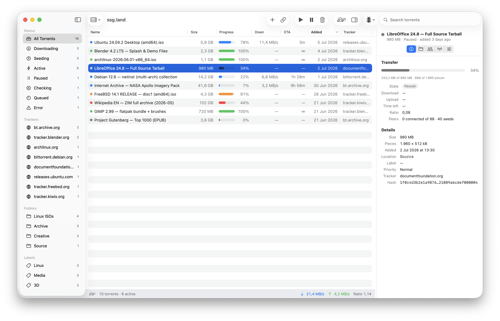

# TransmissionSwift

## What is it

This app lets you connect to a remote Transmission instance over RPC.

- Manage active torrents
  - Start/pause
  - Delete, with or without data
  - Verify
- Add new torrents
  - via .torrent files (drag+drop, or register handler for .torrent files)
  - magnets links via UI
- Enable slow mode

## How to use it

- [Download latest unsigned prerelease](https://github.com/jvacek/TransmissionSwift/releases)
- Find in your downloads, and unzip
- Try to open the unsigned app (it will fail)
- Follow [instructions here](https://github.com/jvacek/TransmissionSwift/releases) to bypass the verification
- Open again

Alternatively, you can open it in XCode and build it from there.

## What's being planned

- Setting priorities
- Support tag colour coding
- Path mapping
- iCloud Sync servers
- Separate polling loop for active torrents
- Filter combination
- iPhone Version
