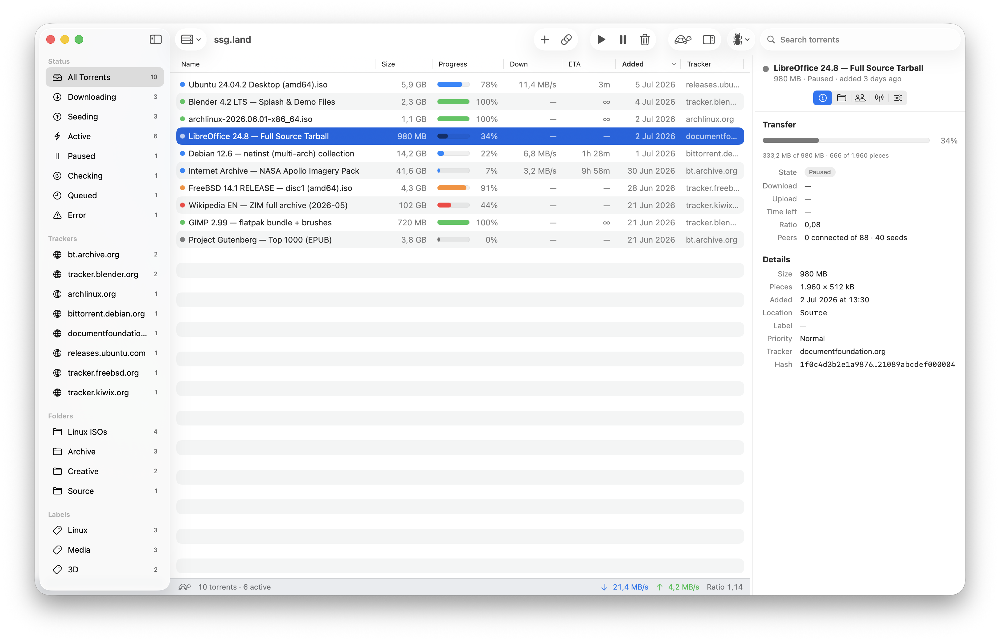

# TransmissionSwift

<!---->

## What is it

This app lets you connect to a remote Transmission instance over RPC.

- Manage active torrents
  - Start/pause
  - Delete, with or without data
  - Verify
- Add new torrents
  - via .torrent files (drag+drop, or register handler for .torrent files)
  - magnets links via UI
- Enable slow mode
- Combining filters in the sidebar
- Managing torrent labels and assigning colour coding to them
- Path mapping via custom URI patterns, open your files with whatever app you want
  - A few ready presets to open in Cyberduck, reveal in Finder (mounted or not), Open in default app, View in Swizzin web
- App self-updating via Sparkle

It is written in Swift and SwiftUI, zipping down to a ~4MB app with minimal resource use.

## How to use it

- [Download latest unsigned prerelease](https://github.com/jvacek/TransmissionSwift/releases)
- Find in your downloads, and unzip
- Try to open the unsigned app (it will fail)
- Follow [instructions here](https://github.com/jvacek/TransmissionSwift/releases)
to bypass the verification
- Open again

Alternatively, you can open it in XCode and build it from there.

## What doesn't work yet
- Changing server settings from the settings page
- Unselecting specific files for download

## What's being planned

1. Separate polling loop for active torrents
1. Setting priorities for torrents and for files
1. iCloud Sync for settings
1. iPhone Version

## Contributing

I will prioritise reviewing any contributions that help overall stability,
performance, and the above mentioned plans.

Please familiarise yourself with the [architecture](ARCHITECTURE.md) and then
feel free todo your thing.
